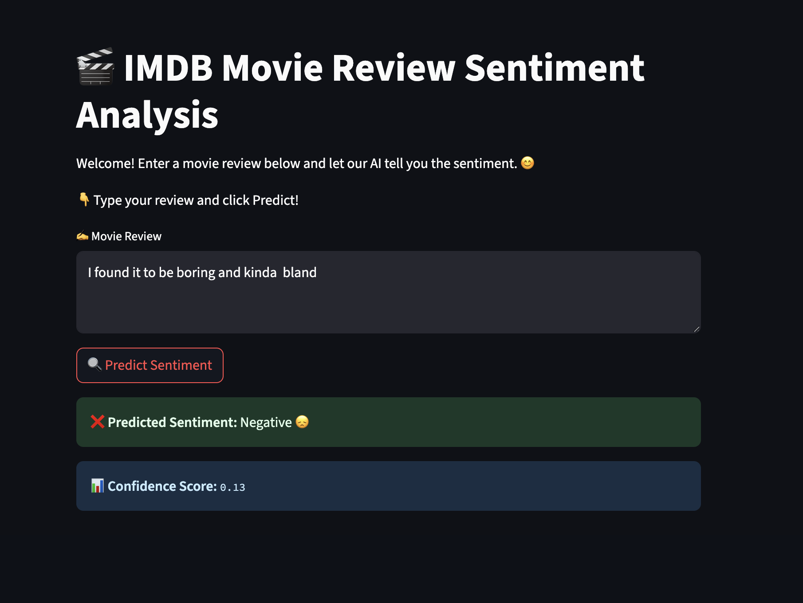

# IMDB Movie Review Sentiment Analysis 🎬

This project uses a simple Recurrent Neural Network (RNN) built with TensorFlow/Keras to classify IMDB movie reviews as positive, neutral, or negative. It includes a Streamlit web app for interactive sentiment prediction.

## Features

- Loads and preprocesses the IMDB dataset
- Trains an RNN for sentiment classification
- Decodes integer-encoded reviews to text
- Interactive Streamlit app for predictions
- Friendly UI with emojis and icons

## Screenshots


### Streamlit Web App




## Getting Started

1. **Clone the repository**
   ```
   git clone https://github.com/yourusername/simpleRNN.git
   cd simpleRNN
   ```

2. **Create and activate a virtual environment**
   ```
   python3 -m venv venv
   source venv/bin/activate
   ```

3. **Install requirements**
   ```
   pip install -r requirements.txt
   ```

4. **Train the model**
   - Run `simple_rnn.ipynb` in Jupyter Notebook or VS Code to train and save the model.

5. **Run the Streamlit app**
   ```
   streamlit run app.py
   ```

## Usage

- Enter a movie review in the web app and click "Predict Sentiment".
- The app will display the predicted sentiment (Positive, Neutral, Negative) with a confidence score.


Made with ❤️ using TensorFlow,
